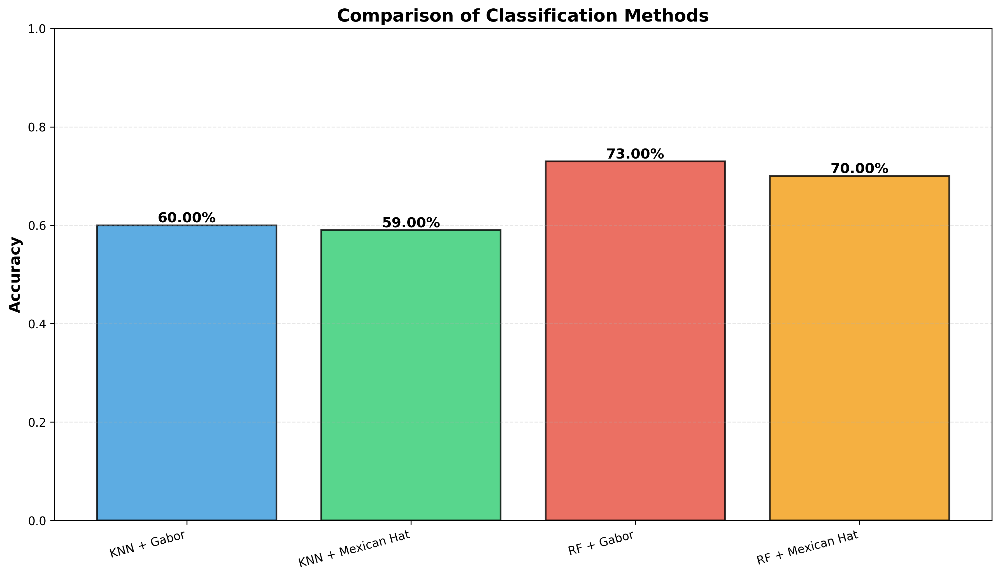
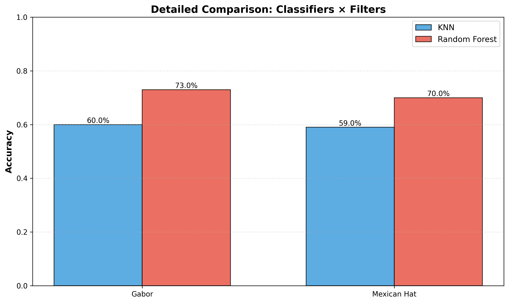
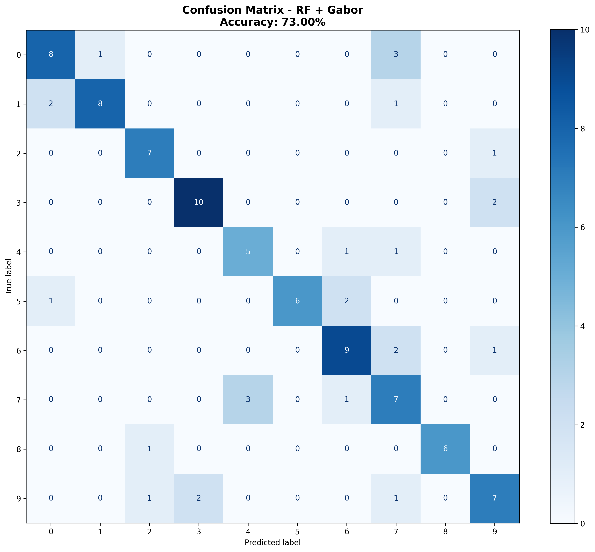
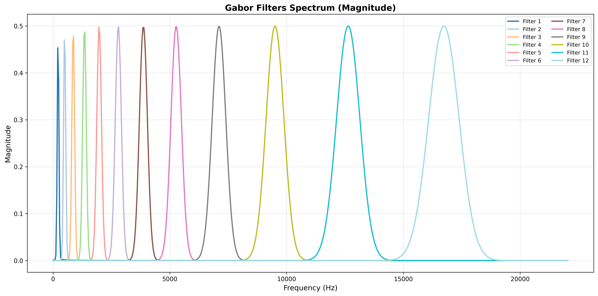
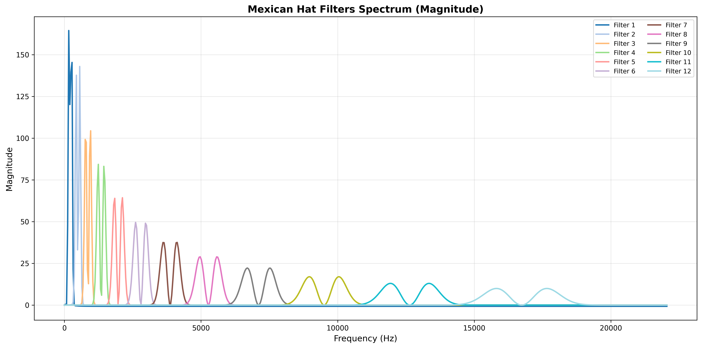

# Audio Classification with Gabor & Mexican Hat Wavelet Filters

Signal processing pipeline for **audio classification** using custom filter banks (Gabor and Mexican Hat Wavelet) combined with machine learning classifiers (KNN and Random Forest).

Implements filter design from scratch, Mel-scale frequency distribution, windowed feature extraction, and comparative evaluation across 4 classifier-filter combinations. Best result: **73% accuracy** with Random Forest + Gabor filters.

---

## Key Features

- **Gabor Filter Bank**: custom implementation with Gaussian-modulated cosine/sine oscillations, distributed across 12 Mel-scale frequency bands
- **Mexican Hat Wavelet Filter Bank**: second derivative of Gaussian, optimized for detecting rapid transients in audio signals
- **Mel-Scale Distribution**: both filter banks use perceptually-motivated frequency spacing (Hz ↔ Mel conversion)
- **Windowed Feature Extraction**: audio segmented into 1102-sample windows with 12ms hop, features computed via efficient matrix multiplication
- **4-Way Comparison**: KNN and Random Forest evaluated with both filter types

---

## Results

| Method | Accuracy |
|---|---|
| Random Forest + Gabor | **73%** |
| Random Forest + Mexican Hat | 70% |
| KNN + Gabor | 60% |
| KNN + Mexican Hat | 59% |

Random Forest outperforms KNN by ~10-13%, and Gabor filters provide a slight edge over Mexican Hat across both classifiers.

---

## Sample Outputs

### Method Comparison


### Detailed Classifier × Filter Analysis


### Confusion Matrix (Best Model: RF + Gabor)


### Gabor Filter Bank Spectrum


### Mexican Hat Filter Bank Spectrum


---

## Project Structure

```
├── filtru_gabor.py             # Gabor filter implementation & filter bank
├── mexican_hat.py              # Mexican Hat Wavelet filter & filter bank
├── get_features.py             # Windowed feature extraction pipeline
├── clasificare_completa.py     # Classification, evaluation & visualization
└── screenshots/
    ├── comparison.png
    ├── detailed_comparison.png
    ├── confusion_matrix.png
    ├── gabor_spectrum.png
    └── mexican_hat_spectrum.png
```

---

## Pipeline Workflow

```
1. Filter Design       → Gabor (Gaussian × cos/sin) and Mexican Hat (∂²Gaussian)
2. Filter Bank         → 12 filters distributed on Mel scale (0 Hz to fs/2)
3. Windowing           → Segment audio into overlapping frames (1102 samples, 12ms hop)
4. Feature Extraction  → Filter response magnitude → mean + std per filter = 2M features
5. Classification      → KNN (k=5) and Random Forest (100 trees)
6. Evaluation          → Accuracy comparison + confusion matrix for best model
```

---

## How to Run

### Requirements

```bash
pip install numpy scipy scikit-learn matplotlib
```

### Usage

Place `data.mat` (audio dataset) in the project directory, then:

```bash
python filtru_gabor.py              # Generate Gabor filter visualizations
python mexican_hat.py               # Generate Mexican Hat filter visualizations
python clasificare_completa.py      # Run classification and generate results
```

---

## Technical Details

### Gabor Filter
Gaussian envelope modulated by cosine/sine carriers: `h(n) = G(n) × cos(2πfn)` where `G(n)` is a centered Gaussian. Provides good time-frequency localization for stationary audio segments.

### Mexican Hat Wavelet
Second derivative of Gaussian: `ψ(t) = (1 - t²) × exp(-t²/2)`. Detects rapid changes and transients in the signal, complementing Gabor's steady-state analysis.

### Feature Extraction
For each audio file: segment into windows → apply all 12 filters (matrix multiplication) → compute magnitude from cos/sin responses → extract mean and standard deviation per filter → concatenate into 24-dimensional feature vector (2 × M where M=12).

---

## Tech Stack

Python · NumPy · SciPy · Scikit-learn · Matplotlib

---

## License

This project is available for reference and educational purposes.
